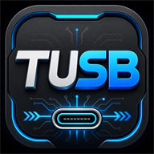
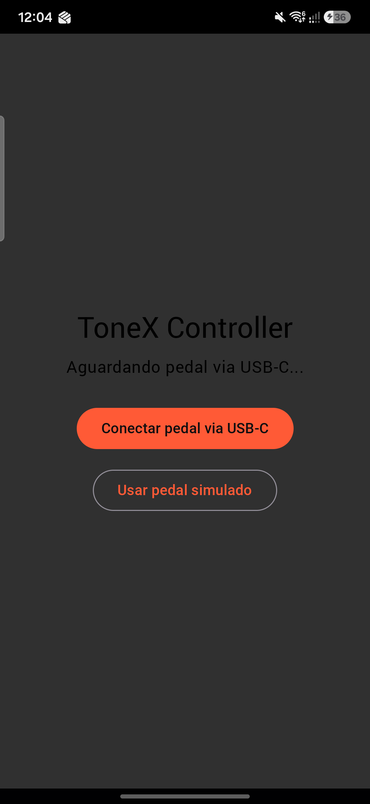
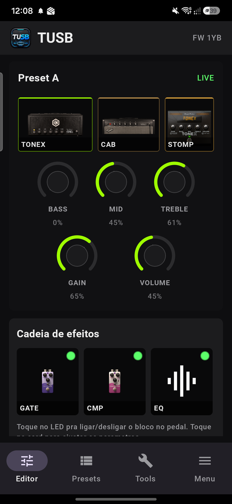
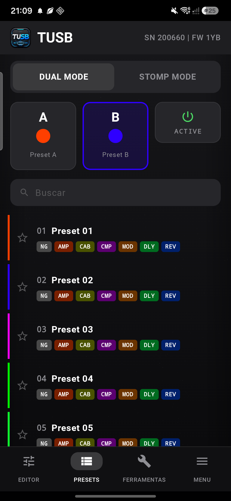
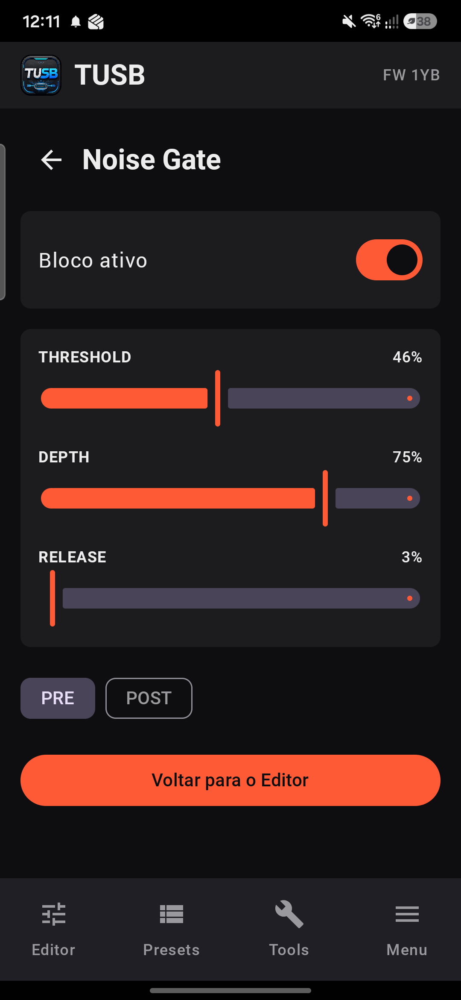
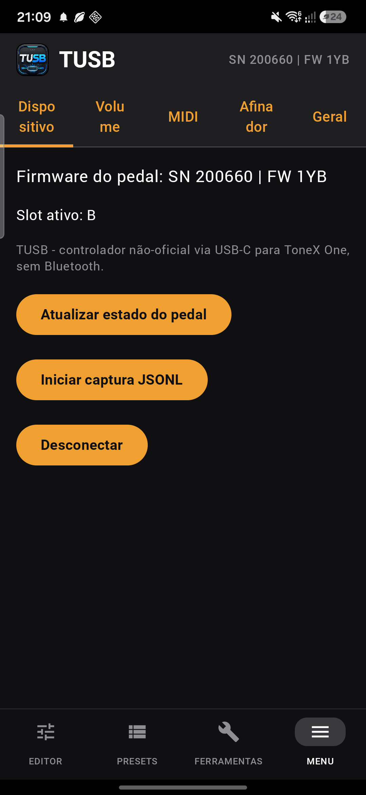

<p align="center">
  
</p>

<h1 align="center">TUSB - ToneX One USB Controller</h1>

<p align="center">
  <strong>Controle Android nativo via USB-C para ToneX One.</strong><br/>
  <strong>Native Android USB-C controller for ToneX One.</strong><br/>
  <strong>Controlador Android nativo por USB-C para ToneX One.</strong>
</p>

<p align="center">
  
  
  
  
</p>

<p align="center">
  🇧🇷 <a href="#-português-brasil">Português Brasil</a> &nbsp;|&nbsp;
  🇺🇸 <a href="#-english-us">English US</a> &nbsp;|&nbsp;
  🇪🇸 <a href="#-español">Español</a>
</p>

---

<p align="center">
  
  
  
  
  
</p>

---

## 🇧🇷 Português Brasil

### Destaques da V1.0.1

- Idioma automático para Português Brasil, Inglês EUA e Espanhol.
- Afinador completo por microfone, com leitura de cents e atalhos para Standard, Drop D,
  meio tom abaixo, D Standard, Open G e DADGAD.
- Nota de conexão inicial destacada no app: coloque o ToneX One em modo Stomp e pressione o
  pedal três vezes para conectar.
- Nota em destaque: versão para iOS em desenvolvimento. Em breve.
- Documentação de instalação e uso em três idiomas.

### O que é

O **TUSB** é um app Android comunitário que conecta diretamente ao **ToneX One** por cabo
USB-C OTG. Ele usa comunicação serial USB nativa para editar presets, alternar slots,
controlar efeitos e manter o app sincronizado com o pedal em tempo real.

### Recursos

- Conexão USB-C direta, sem Bluetooth e sem computador.
- Troca de preset e slot A/B/C.
- Alternância entre modo A/B e modo Stomp.
- Bypass geral e bypass IR/Cab.
- Knobs de amplificador em tempo real.
- Cadeia de efeitos editável: Gate, Compressor, EQ, Mod, Delay, Reverb e Cab.
- Metrônomo local.
- Afinador por microfone com afinações comuns.
- Captura JSONL para diagnóstico.

### Instalação e uso

- Instalação: [docs/INSTALL.md](docs/INSTALL.md)
- Guia de uso: [docs/USER_GUIDE.md](docs/USER_GUIDE.md)
- Resultado VirusTotal: [docs/VIRUSTOTAL.md](docs/VIRUSTOTAL.md)

### Build local

```bash
git clone https://github.com/acf1210/TUSB.git
cd TUSB
./gradlew assembleDebug
./gradlew test
```

O APK debug fica em `app/build/outputs/apk/debug/app-debug.apk`.

---

## 🇺🇸 English US

### V1.0.1 highlights

- Automatic language support for Brazilian Portuguese, US English, and Spanish.
- Full microphone tuner with cents reading and shortcuts for Standard, Drop D, half-step
  down, D Standard, Open G, and DADGAD.
- Highlighted initial connection note in the app: put ToneX One in Stomp mode and press the
  pedal three times to connect.
- Highlighted note: iOS version in development. Coming soon.
- Install and user guides in three languages.

### What it is

**TUSB** is a community Android app that connects directly to **ToneX One** over a USB-C OTG
cable. It uses native USB serial communication to edit presets, switch slots, control
effects, and keep the app synchronized with the pedal in real time.

### Features

- Direct USB-C connection, no Bluetooth and no computer required.
- Preset and A/B/C slot switching.
- A/B and Stomp mode switching.
- Global bypass and IR/Cab bypass.
- Real-time amp knobs.
- Editable effect chain: Gate, Compressor, EQ, Mod, Delay, Reverb, and Cab.
- Local metronome.
- Microphone tuner with common tunings.
- JSONL capture for diagnostics.

### Install and use

- Installation: [docs/INSTALL.md](docs/INSTALL.md)
- User guide: [docs/USER_GUIDE.md](docs/USER_GUIDE.md)
- VirusTotal result: [docs/VIRUSTOTAL.md](docs/VIRUSTOTAL.md)

### Local build

```bash
git clone https://github.com/acf1210/TUSB.git
cd TUSB
./gradlew assembleDebug
./gradlew test
```

The debug APK is generated at `app/build/outputs/apk/debug/app-debug.apk`.

---

## 🇪🇸 Español

### Novedades de la V1.0.1

- Idioma automático para Portugués Brasil, Inglés EUA y Español.
- Afinador completo por micrófono, con lectura de cents y accesos rápidos para Standard,
  Drop D, medio tono abajo, D Standard, Open G y DADGAD.
- Nota destacada de conexión inicial en la app: pon el ToneX One en modo Stomp y presiona el
  pedal tres veces para conectar.
- Nota destacada: versión para iOS en desarrollo. Próximamente.
- Guías de instalación y uso en tres idiomas.

### Qué es

**TUSB** es una app Android comunitaria que se conecta directamente al **ToneX One** con un
cable USB-C OTG. Usa comunicación serial USB nativa para editar presets, cambiar slots,
controlar efectos y mantener la app sincronizada con el pedal en tiempo real.

### Funciones

- Conexión USB-C directa, sin Bluetooth y sin ordenador.
- Cambio de preset y slots A/B/C.
- Cambio entre modo A/B y modo Stomp.
- Bypass general y bypass IR/Cab.
- Knobs de amplificador en tiempo real.
- Cadena de efectos editable: Gate, Compressor, EQ, Mod, Delay, Reverb y Cab.
- Metrónomo local.
- Afinador por micrófono con afinaciones comunes.
- Captura JSONL para diagnóstico.

### Instalación y uso

- Instalación: [docs/INSTALL.md](docs/INSTALL.md)
- Guía de uso: [docs/USER_GUIDE.md](docs/USER_GUIDE.md)
- Resultado VirusTotal: [docs/VIRUSTOTAL.md](docs/VIRUSTOTAL.md)

### Build local

```bash
git clone https://github.com/acf1210/TUSB.git
cd TUSB
./gradlew assembleDebug
./gradlew test
```

El APK debug se genera en `app/build/outputs/apk/debug/app-debug.apk`.

---

## Legal

This is an independent community interoperability project. It is not affiliated with,
endorsed by, or sponsored by any trademark owner. The original source code in this
repository is distributed under the [MIT license](LICENSE).
